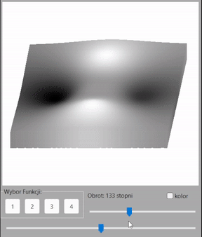

# 3D-Function-Visualization

This is a C++ application for visualizing 3D function plots using Shepard's method of function approximation and voxel space methods simultaneously. The application leverages the wxWidgets library for the GUI and wxFormBuilder for the design of the interface. This project was developed as part of a university course on computer graphics.

## Features

- **3D Function Plotting**: Visualize functions of two variables using predefined functions.
- **Shepard's Method and Voxel Space**: Simultaneously apply Shepard's method for function approximation and use voxel space technique for visualization.
- **Predefined Functions**: Choose from four predefined functions to visualize.
- **Interactive Visualization**: Change the viewing angle and rotate the visualization using sliders.

## Demo

## Usage
1. Launch the application.
2. Select one of the four predefined functions to visualize.
3. Use the sliders to change the viewing angle and rotate the visualization interactively.

## Instalation
file .exe works correctly on Windows.
